# DOCUMENTATION OF PROJECT 4
## MEAN STACK IMPLEMENTATION

STEP 1: INSTALL NODEJs

`sudo apt update`

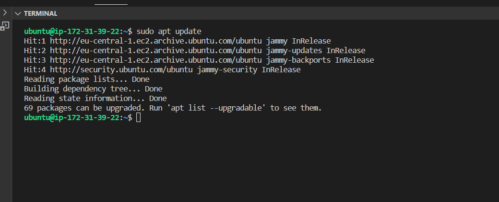

`sudo apt upgrade`

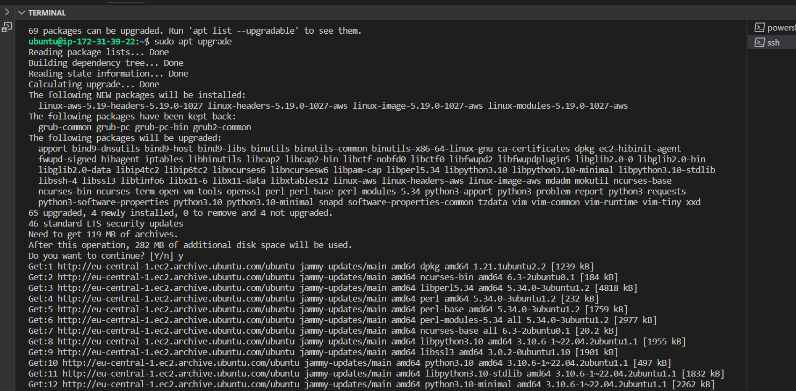

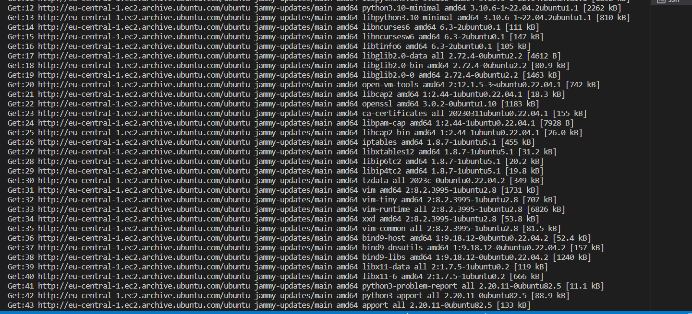

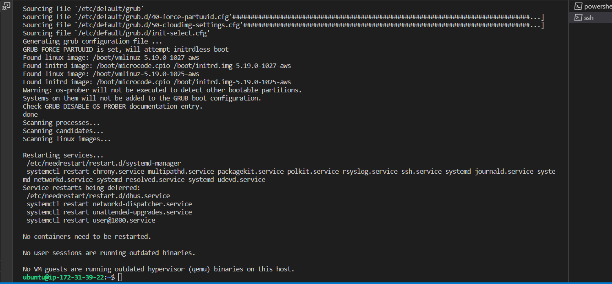

Add certificates

`sudo apt -y install curl dirmngr apt-transport-https lsb-release ca-certificates`

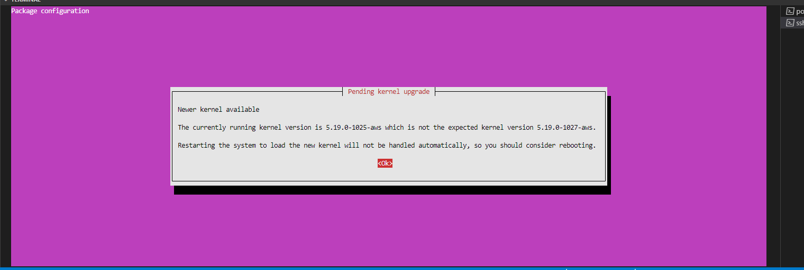

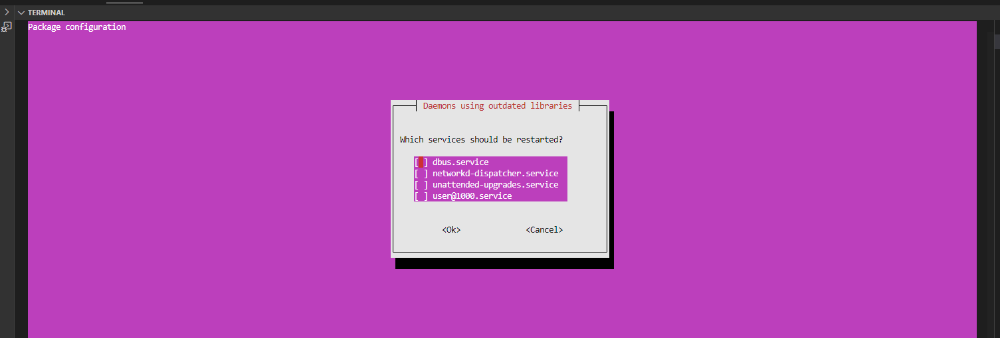

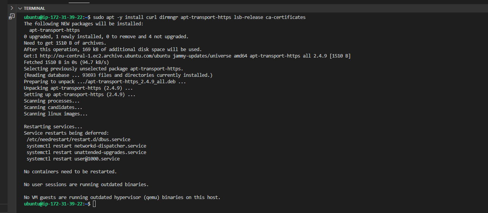

`curl -sL https://deb.nodesource.com/setup_18.x | sudo -E bash`

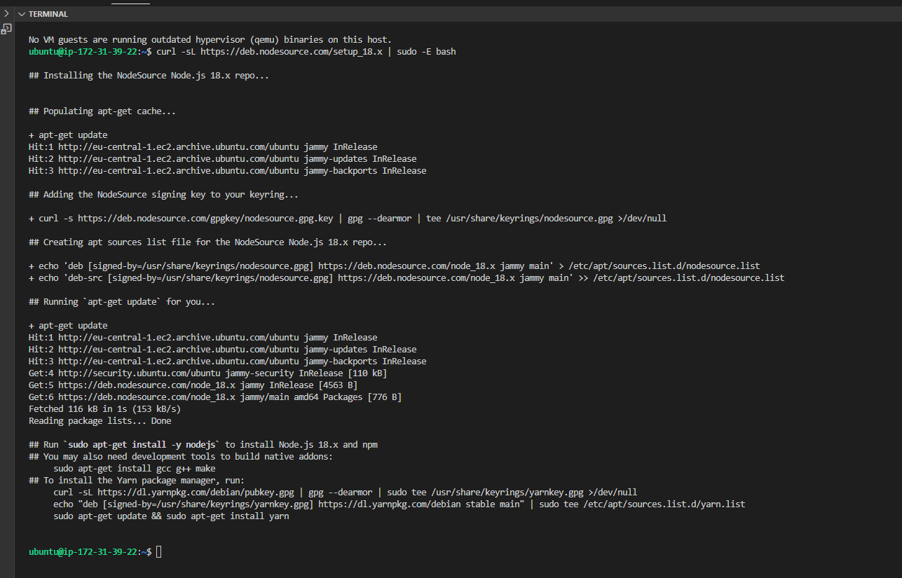

`sudo apt install -y nodejs`

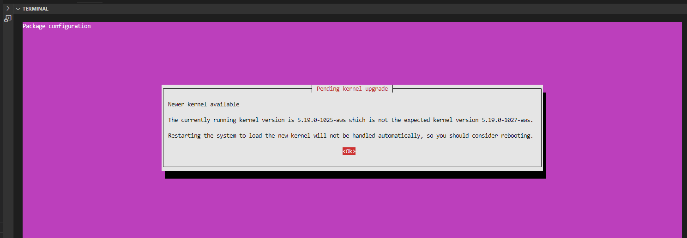

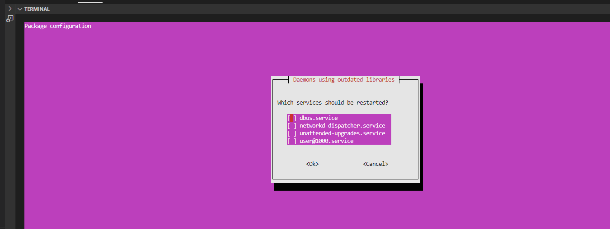

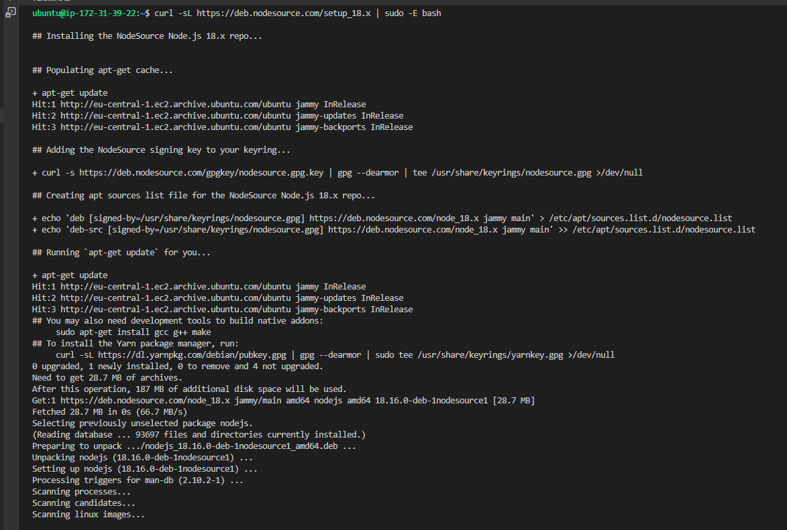

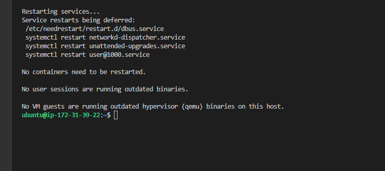

STEP 2: INSTALL MongoDB

`sudo apt-key adv --keyserver hkp://keyserver.ubuntu.com:80 --recv 0C49F3730359A14518585931BC711F9BA15703C6`

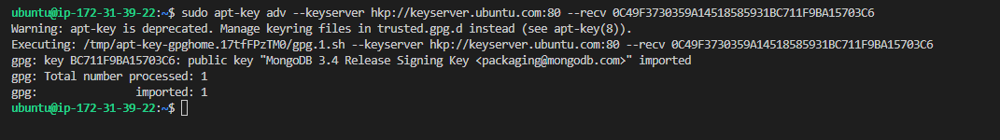

`echo "deb [ arch=amd64 ] https://repo.mongodb.org/apt/ubuntu trusty/mongodb-org/3.4 multiverse" | sudo tee /etc/apt/sources.list.d/mongodb-org-3.4.list`

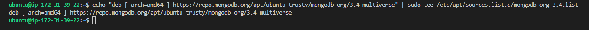

`sudo apt install -y mongodb`

[installing mongodb](./images/installing_mongodb/installing_mongodb.png)

`sudo service mongodb start`

`sudo systemctl status mongodb`

[verifying mongodb service is running](./images/installing_mongodb/verifyin_mongodb_service.png)

`sudo apt install -y npm`

`npm`

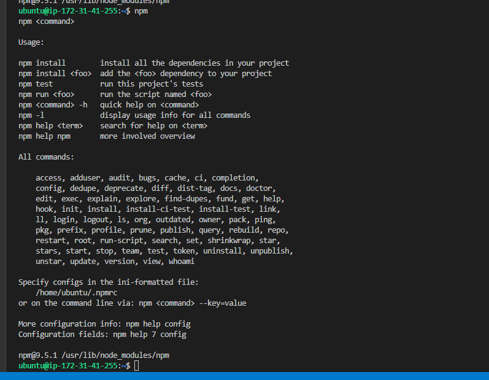

`sudo npm install body-parser`

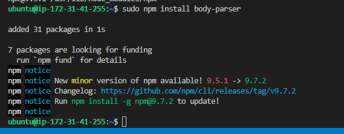

create Books directory and cd to books directory

`mkdir Books && cd Books`

`npm init`

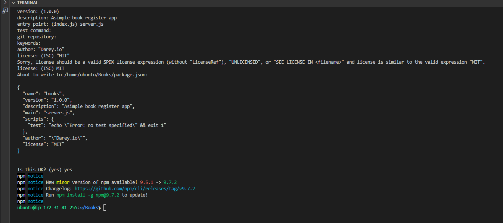

add file server.js

`vi server.js`

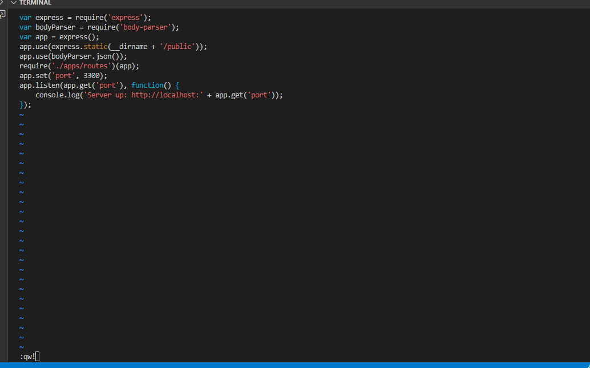

STEP 3: INSTALL EXPRESS

`sudo npm install express mongoose`

`mkdir apps && cd apps`

`vi routes.js`

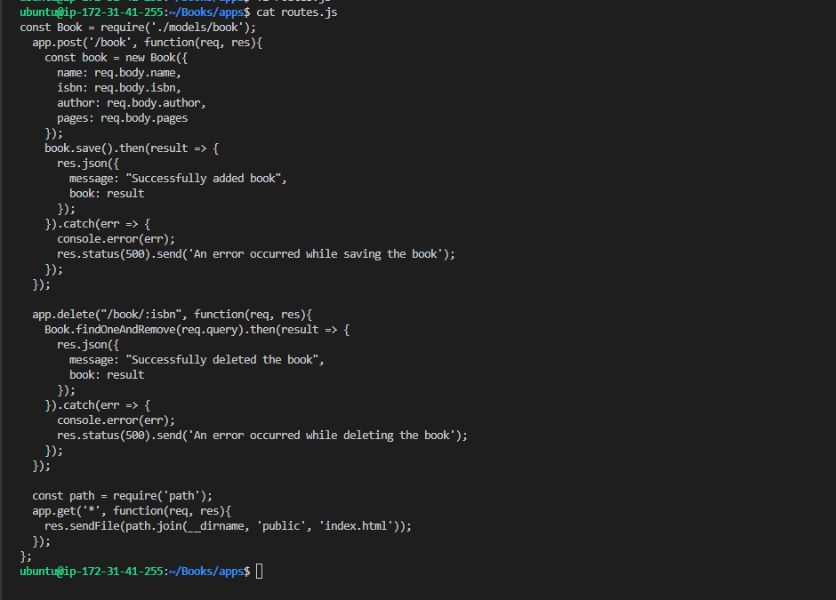

`mkdir models && cd models`

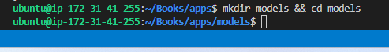

`vi book.js`

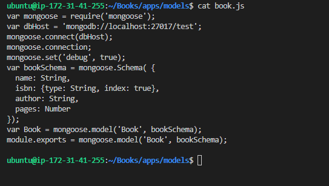

STEP 4 ACCESS THE ROUTES WITH AngularJS

