# DOCUMENTATION OF PROJECT 4
## MEAN STACK IMPLEMENTATION

STEP 1: INSTALL NODEJs

`sudo apt update`

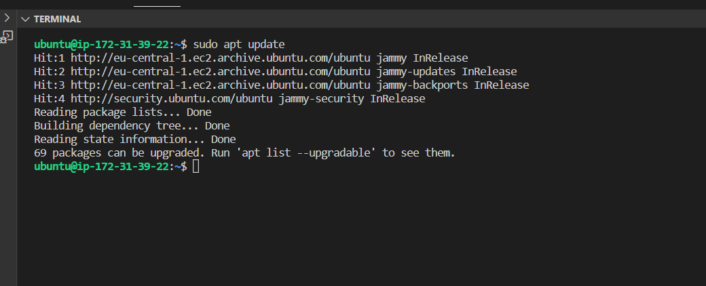

`sudo apt upgrade`

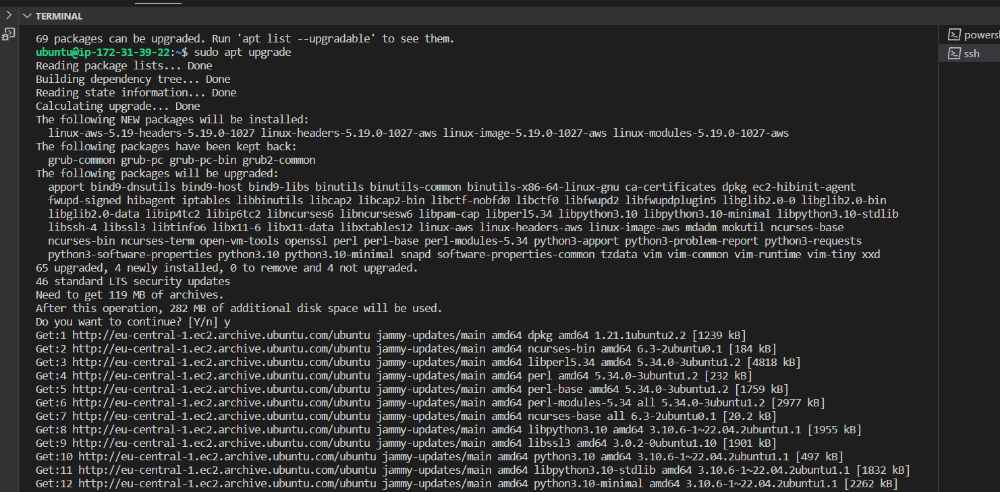

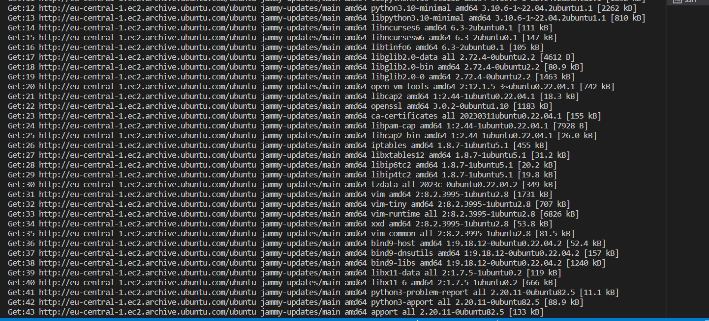

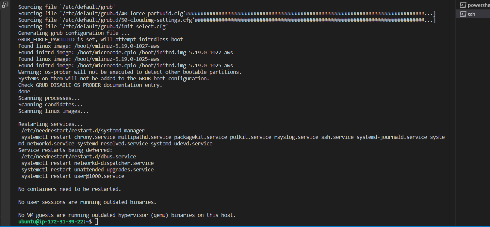

Add certificates

`sudo apt -y install curl dirmngr apt-transport-https lsb-release ca-certificates`

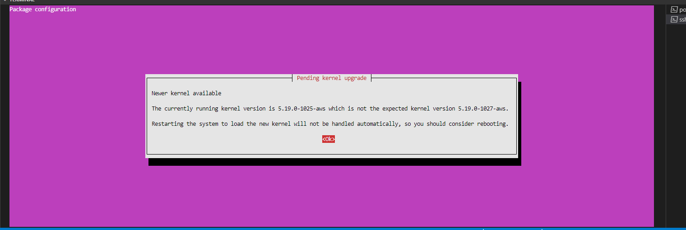

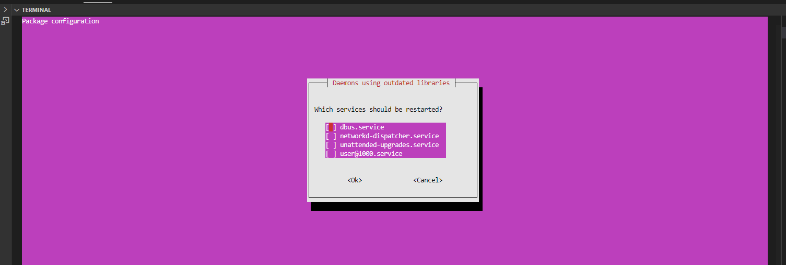

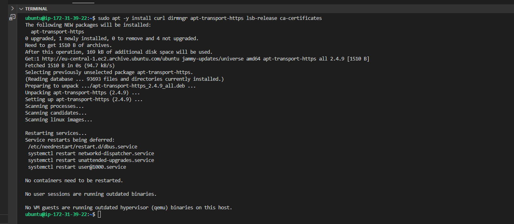

`curl -sL https://deb.nodesource.com/setup_18.x | sudo -E bash`

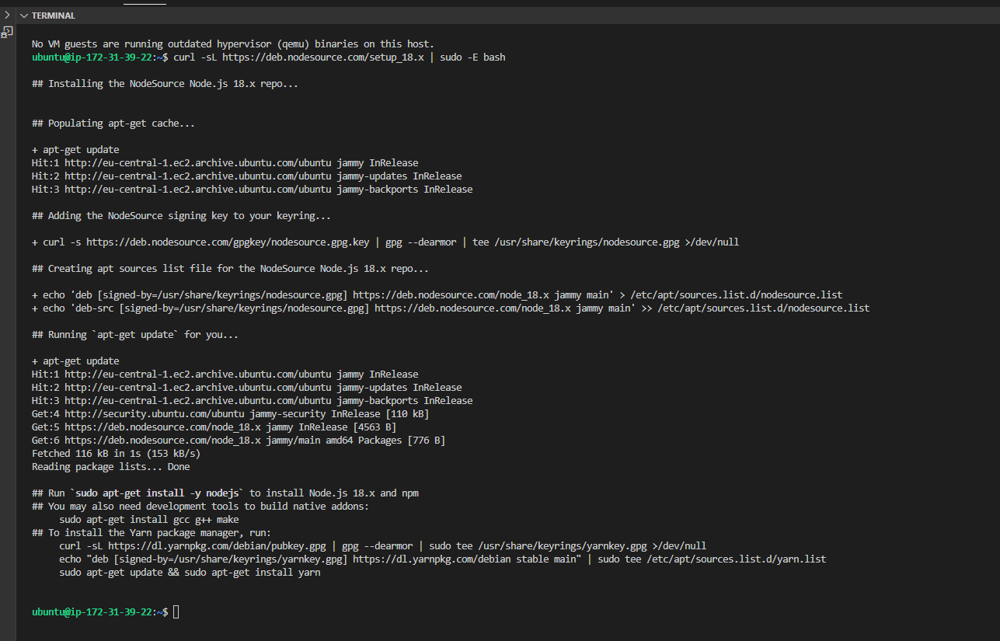

`sudo apt install -y nodejs`

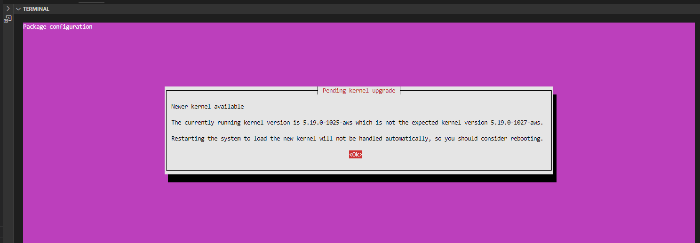

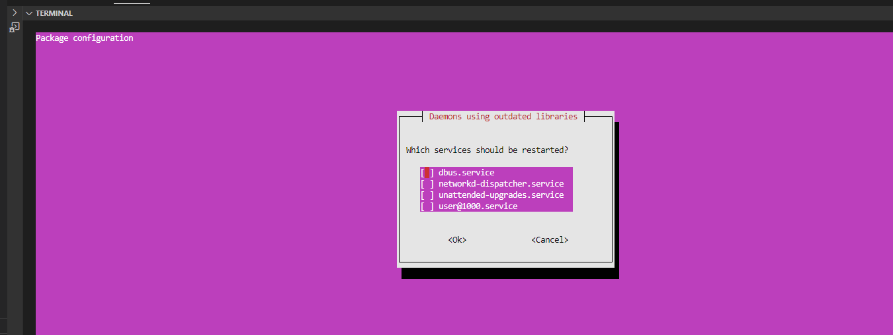

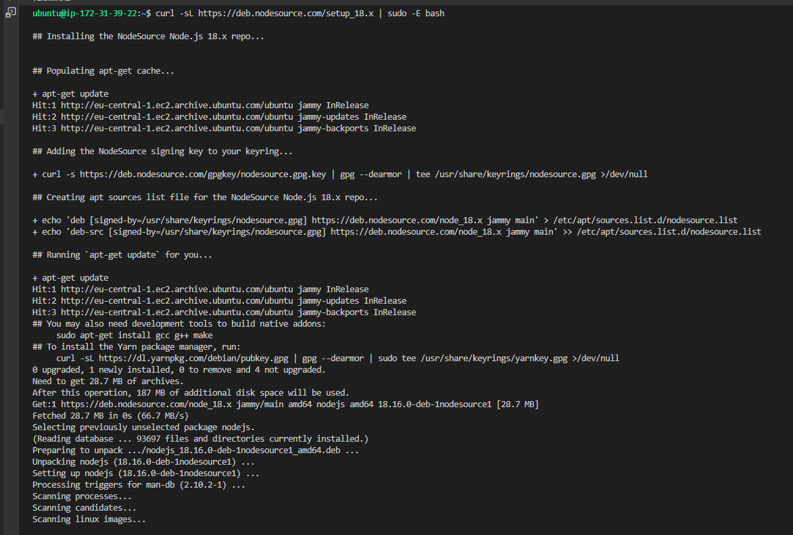

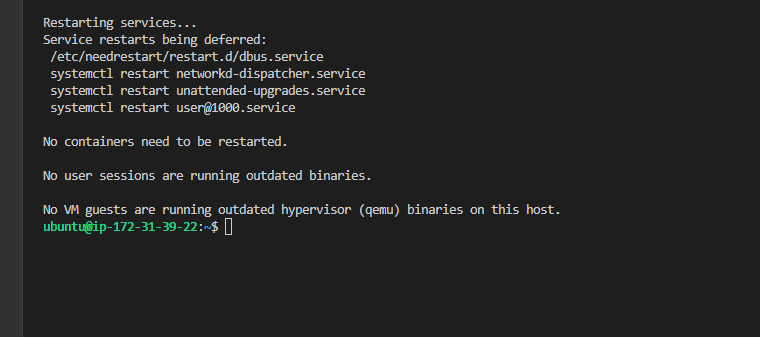

STEP 2: INSTALL MongoDB

